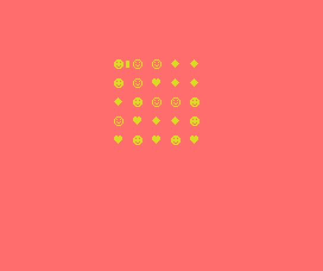

# CandyBAS
CandyBAS is a match-3 puzzle game in 10 lines of MSX2 BASIC v3



# Game Logic
Player tries to align 3 candies in sequence to grab them.
Candy shapes are:
- &hearts; heart
- &diams; diamond
- &#x263B; face
- &#x263A; reverse face

Player swaps candies to try to align them, if a move doesn't align 3 or more shapes they return to previous position and points are resetted.

# Controls
Arrow keys are used to move the cursor and space bar to swap candies on screen.
Cursor movement is like over a chessboard: at any moment only two candies are adajcent to the cursor, swap acts on these ones.

Sources are stored at: https://github.com/robertocapuano/CandyBAS

# Installation
Game was developed in MSX-BASIC v3 on a MSX2+. Emulator is available at https://webmsx.org/
1. connect to https://webmsx.org/
2. click on the first floppy icon below the blue screen
3. Select "Add Disk Images"
4. Choose "candy.dsk"
5. type in:
```
load "a:candy.bas"
run
```

otherwise
1. connect to https://webmsx.org/
2. press ALT+B
3. copy and paste source code
5. type in:
```
run
```

WebMSX Launch URL:
- https://webmsx.org?MACHINE=MSX2P&DISK=https://github.com/robertocapuano/CandyBAS/raw/master/candy.dsk&BASIC_RUN=candy.bas

MSXPen link:
- https://msxpen.com/?code=-M0HbGDNyallnQfqWoIp

# Source Description

```
1 SCREEN1:COLOR10,9,9:CLS:KEYOFF:DEFINTA-Z:C=1:B=6283:X=B:Z=RND(-TIME):U=64:V=2
```
- SCREEN1: select 32x24 text mode
- COLOR10,9,9: select color yellow on red
- CLS: clear screen
- KEY OFF: hide command bar
- DEF INT A-Z: set A-Z as integer variables
- C=1,R=0: initial cursor position, column 1, row 0
- B=6283: base video memory address for screen1
- Z=RND(-TIME): initialize random number generator
- U=64,V=2: U,V contains offset values for next row and next column

```
2 S=1+31*F:Y=X-S:Z=X+S:T=vpeek(Y):vpokeY,vpeek(Z):vpokeZ,T:W=W-1:ifW=0thenP=0
```
- S contains offset to adjacent cell
- X: pointer to cursor cell
- Y,Z adjacents cells pointers
- T: temporary value of Y
- vpokeY... swaps values
- W=2: user swaps symbols, W=1 swap operation doens't obtain a match-3, W=0: no operation

```
3 locate21,0:?"PTS"P" ":H=0:FORI=0TO4:G=B+I*2:ifvpeek(G)=32thenvpokeG,RND(1)*4+1
```
- P: contains player points
- G: contains video memory pointer to actual row procesed
- H=0: change flag of puzzle content
- FORI=... initialize first row with random symbols

```
4 forJ=4TO1step-1:A=G+J*64:ifvpeek(A)=32thenvpokeA,vpeek(A-64):vpokeA-64,32:H=1
```
- Scroll values for a row to the next one if this is empty (ASCII 32)
- A: contains video memory pointer to actual processed char

```
5 nextJ,I:ifH=1then3elseforK=0to1:forJ=0TO4:forI=0TO2:A=B+J*V+I*U:T=vpeek(A):N=0
```
- if change flag is setted repeat previous step
- else start match-3 check loop

```
6 N=N+1:ifT<32andT=vpeek(A+N*U)then6:elseifN>2thenforM=0toN-1:vpokeA+M*U,32:next
```
- checks if there are at least 3 symbols that matches, this is peformed in horizontal and vertical direction, using variables U,V as offsets for next row/column

```
7 H=H-(N>2):nextI,J:swapU,V:next:ifH>0thenP=P+H:W=0:goto3:elseifW>0then2:elseW=2
```
- add 1 to H in case of a match
- if H, the change flag, is setted repeat previous steps
- otherwise reverse symbols switch: no match-3 performed
- H>0 player did almost one match
- W=0 no other swaps are necessary
- W>0 player failed to obtain a match, a reverse swap will be done
- reset value of W=2

```
8 X=B+C+R*32:vpokeX,254:K$=INKEY$:IFK$=""then8:elsevpokeX,32:ifK$=" "andC<9then2
```
- X contains cursor video memory pointer
- K$=INKEY$:IFK$=""then7 read keyboard input
- vpokeX,254: show cursor
- if user presses space bar and the cursor is on the right side nothing is done
- pokeX,32: hide cursor

```
9 k=ASC(k$):ifK=31andr<8thenR=R+1:C=Cxor1:elseifK=30andR>0thenR=R-1:C=Cxor1
```
- K=31 in case of down direction: cursor is moved to next row: R=R+1
- K=30 in case of up direction: cursor is moved to previous row: R=R-1
- C=Cxor1: produces alternate position of the cursor like a chessboard

```
10 F=Rmod2:ifK=28andC<7thenC=C+2:goto8:elseifK=29andC>1thenC=C-2:goto8:else8
```
- K=28 in case of left direction: cursor is moved to previous column: C=C-2
- K=29 in case of right direction: cursor is moved to next column: C=C+2

